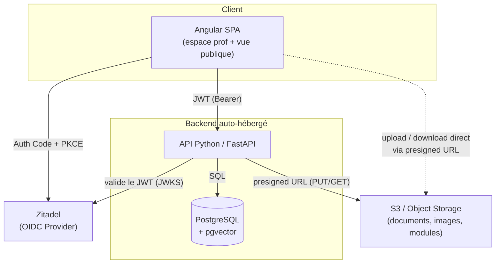
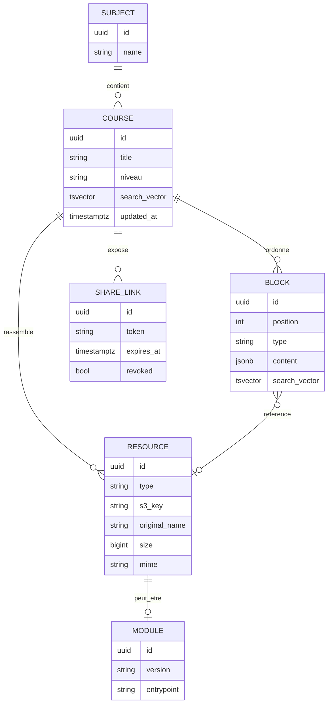

# Cartable — Plateforme pédagogique auto-hébergée

> **Pitch & cadrage technique** — document de cadrage destiné à amorcer le développement (Claude Code).
> *Cartable* est un nom de travail, à remplacer librement.

---

## 1. En une phrase

Une plateforme où un enseignant compose ses cours (texte, documents, images, modules interactifs), les organise par matière, et les partage à ses élèves via de simples liens publics — l'édition étant réservée au prof via authentification.

---

## 2. Le besoin métier

### Contexte
Un enseignant produit beaucoup de supports hétérogènes (PDF, images, schémas, énoncés, et à terme des exercices interactifs en HTML/JS). Aujourd'hui ces ressources sont éparpillées (mail, clé USB, ENT, Drive). Il manque **un point d'entrée unique, organisé et partageable** que les élèves consultent sans friction (pas de compte à créer).

### Utilisateurs & rôles
| Rôle | Authentification | Peut |
|------|------------------|------|
| **Prof** (toi) | OIDC / Zitadel | Créer / organiser / éditer cours, ressources et modules ; gérer les liens de partage |
| **Élève** | Aucune (lien public) | Consulter un cours partagé, télécharger les documents, lancer les modules interactifs |

### Cas d'usage clés (user stories)
- *En tant que prof*, je crée un cours « Suites numériques » et j'y agence un texte d'introduction, deux PDF, trois images et un quiz interactif, dans l'ordre que je veux.
- *En tant que prof*, je génère un lien public pour ce cours et je le colle dans l'ENT / au tableau.
- *En tant que prof*, je retrouve un ancien support en cherchant « théorème de Pythagore » dans toute ma base.
- *En tant qu'élève*, j'ouvre le lien, je lis le cours, je télécharge le PDF et je fais le quiz — sans créer de compte.

### Hors périmètre (volontairement)
Notes, rendus d'élèves, messagerie, gestion de classe. Ce n'est pas un ENT, c'est un **hub de diffusion de contenu pédagogique**.

---

## 3. Périmètre fonctionnel

### MVP (ce qu'on code en premier)
- Auth prof via Zitadel (OIDC).
- CRUD **Cours** organisés par **Matière**.
- Upload de ressources (PDF, images) vers S3 + métadonnées en base.
- Édition d'un cours sous forme de **blocs ordonnés** (texte riche + ressources intercalées).
- Génération d'un **lien public** par cours ; rendu lecture seule pour les élèves.
- Recherche plein texte sur titres / contenu / tags.

### V1
- **Modules interactifs** HTML/JS (upload, sandbox, intégration dans un cours).
- Facettes de recherche (matière, niveau, type).
- Aperçus / miniatures des documents.
- Liens de partage avec options (expiration, révocation).

### Plus tard — couche IA (terrain déjà préparé)
- Extraction de texte des documents → indexation sémantique (**pgvector**).
- Recherche sémantique et RAG sur la base de cours.
- Génération assistée : résumés, quiz, fiches de révision à partir d'un cours.

---

## 4. Architecture cible

### Composants & responsabilités
- **Angular SPA** — UI unique servant à la fois l'espace prof (authentifié) et la vue publique des cours partagés. Gère le flow OIDC côté navigateur.
- **API FastAPI** — logique métier, autorisation, modèle de données, signature des URL S3, recherche. Choix de Python pour préparer la couche IA.
- **PostgreSQL** — source de vérité des métadonnées, du contenu éditorial (blocs) et de l'indexation. `pgvector` activé dès le départ pour ne pas avoir à migrer plus tard.
- **S3** — stockage des binaires (fichiers, images, bundles de modules). Bucket **privé** ; tout accès passe par des URL présignées.
- **Zitadel** — fournisseur OIDC, gère uniquement l'identité du/des profs.

### Stack retenue
| Couche | Choix | Notes |
|--------|-------|-------|
| Front | Angular | + `angular-oauth2-oidc` pour le flow OIDC |
| API | Python / **FastAPI** | async, typé (Pydantic), OpenAPI auto |
| ORM / migrations | SQLModel ou SQLAlchemy + **Alembic** | |
| Auth API | validation JWT via **JWKS** Zitadel (`authlib` / `pyjwt`) | |
| Stockage | **boto3** (compatible S3) | presigned URLs |
| Recherche | Postgres **FTS** (`tsvector`/GIN) → puis pgvector | |
| Déploiement | Docker Compose + reverse proxy (Caddy/nginx) | sur Raspberry Pi |

---

## 5. Enjeux techniques

C'est le cœur du projet. Chaque point ci-dessous est un vrai arbitrage à trancher tôt.

### 5.1 Authentification & double régime d'accès
Le point structurant : **deux populations, deux modèles d'accès** sur la même API.
- **Prof** : flow OIDC *Authorization Code + PKCE* (client public Angular, pas de secret). L'API ne fait **pas** de session : elle valide le JWT Zitadel à chaque requête (signature via JWKS, vérif `issuer` / `audience` / expiration) et lit les rôles dans les claims.
- **Élève** : **non authentifié**. L'accès est porté par un *token de partage* opaque (cf. 5.6), pas par une identité.
- Conséquence : des routes « admin » (JWT requis) et des routes « publiques » (token de partage requis) bien séparées, avec deux dépendances d'autorisation distinctes côté FastAPI.

### 5.2 Stockage & gestion des fichiers (S3)
- **Bucket privé**, jamais exposé directement. L'API mint des **URL présignées** : `PUT` pour l'upload, `GET` (TTL court) pour la lecture/téléchargement.
- **Upload direct navigateur → S3** via presigned PUT, pour ne **pas** faire transiter les gros fichiers par le backend (essentiel vu l'hébergement sur Pi : on préserve RAM et bande passante du serveur).
- **Organisation** : arborescence S3 *plate* (clé = `uuid/nom-original`) + toute la hiérarchie logique (matière → cours → ressource) portée par la **base**, pas par les préfixes S3. Plus souple pour réorganiser sans déplacer des octets.
- **Types & previews** : PDF et images au MVP. Génération de miniatures/aperçus à différer (coûteux en CPU sur ARM — à faire en tâche asynchrone, voire à la demande).

### 5.3 Modélisation du contenu : le cours comme suite de blocs
Pour « agencer texte de cours + documents + images », le modèle gagnant est un **contenu par blocs ordonnés** (façon éditeur type Notion, en plus simple).
- Un cours = une liste ordonnée de blocs : `paragraphe`, `titre`, `image`, `fichier`, `module interactif`, `encadré`.
- Le **texte riche** est stocké en **JSONB** (structure de blocs), pas en HTML brut → plus sûr, plus facile à réindexer et à exploiter plus tard par l'IA.
- Les blocs « média » ne contiennent qu'une **référence** vers une ligne `resource` (elle-même pointant vers S3). Le binaire et l'éditorial restent découplés.
- Enjeu UX côté Angular : éditeur d'ordre des blocs (drag & drop) et insertion de ressources existantes ou nouvelles.

### 5.4 Recherche (J3 — livré)
- **FTS Postgres** en config **`french_unaccent`** (extension contrib `unaccent` + copie de `french` : stemming ET insensibilité aux accents). Vecteurs `tsvector` **stockés** sur `courses` (titre poids A, description B) et `blocks` (titre B, contenu C — champ par champ, **jamais les corrigés d'exercice**), maintenus par **triggers PostgreSQL**, index **GIN** ; requêtes `websearch_to_tsquery`.
- **Recherche publique sans compte** (`/api/v1/public/search/courses|teachers` + page front `/:lang/search`) : seuls les cours **publics** remontent ; un prof n'apparaît que s'il a coché l'opt-in `searchable` de son profil, renseigné un `public_name` et publié au moins un cours (vecteur prof calculé à la volée : nom + matières enseignées).
- Facettes : matière (sous-arbre entier via le `code`), niveau (nœud + enfants) — arbres de taxonomie exposés en lecture publique pour les sélecteurs. Pagination `{items, total, limit, offset}`. Recherche sans texte libre = catalogue trié par récence.
- Évolution : recherche **sémantique** (ChromaDB si actée, cf. 5.7), combinable avec la FTS (recherche hybride).

### 5.5 Modules interactifs HTML/JS
Le point le plus sensible niveau sécurité : tu vas servir du **code arbitraire** (le tien, mais quand même).
- Un module = **bundle HTML/JS auto-porté** (un dossier ou un `.zip`), stocké sur S3, métadonnées en base.
- Rendu **isolé** : intégration via `<iframe sandbox>` servie depuis un **chemin/origine séparé** de l'app principale, avec une **CSP** stricte → empêche un module de toucher au DOM de l'app, aux tokens, etc.
- **Versionnage** par clé S3 (`module-id/v3/...`) pour pouvoir corriger un module sans casser les liens existants.
- Communication module ↔ app éventuelle via `postMessage` contrôlé (utile plus tard, ex. remonter un score).

### 5.6 Partage public par lien
- Chaque partage = un **token opaque non devinable** (≥128 bits), lié à un cours.
- Le token donne accès en **lecture seule** au cours et déclenche la génération d'URL présignées pour ses ressources. **Le bucket n'est jamais public.**
- Options à prévoir : révocation, expiration, éventuellement granularité (cours entier vs ressource unique).
- À surveiller : un lien public reste *diffusable* — pas de données sensibles dans les cours partagés (rien de personnel sur des élèves de toute façon, cf. périmètre).

### 5.7 Préparation de la couche IA
- Activer l'extension **pgvector dès la 1ʳᵉ migration** (éviter une migration lourde plus tard).
- Prévoir, sans l'implémenter au MVP : un pipeline *extraction de texte (PDF/images) → découpage → embeddings → stockage vectoriel*, déclenché en tâche de fond à l'upload.
- Le choix Python/FastAPI rend naturelle l'intégration ultérieure (RAG, génération de quiz/résumés). Pour le fournisseur de modèle, garder en tête la contrainte RGPD (option hébergée UE type Mistral, ou modèle local selon ressources).

### 5.8 Déploiement & contraintes Raspberry Pi
- **ARM64 + RAM limitée** : tout ce qui est lourd (transfert de fichiers, génération de miniatures, embeddings) doit être **déporté** (presigned URLs) ou **asynchrone**.
- **Zitadel et S3 sont supposés fournis** (externes ou sur une autre machine). Co-héberger Zitadel *et* l'app *et* Postgres *et* du vectoriel sur un seul Pi serait tendu : à arbitrer (Zitadel est gourmand).
- **Conteneurisation** Docker Compose, **reverse proxy** (Caddy = HTTPS/Let's Encrypt automatique, idéal ici) devant l'API et le SPA.
- Build Angular en amont (image statique servie par le proxy), pas de build sur le Pi en prod.

---

## 6. Modèle de données (esquisse)

---

## 7. Roadmap par jalons

| Jalon | Contenu | Objectif |
|-------|---------|----------|
| **J0 — Socle** | Repo, Docker Compose, FastAPI + Postgres + Alembic, validation JWT Zitadel, squelette Angular + login OIDC | Une route protégée qui répond, un login prof qui marche |
| **J1 — Contenu** | Matières, cours, upload S3 (presigned), éditeur de blocs basique | Le prof crée et remplit un cours |
| **J2 — Partage** | Liens publics, vue lecture seule élève, présignature des ressources | Un cours consultable par lien |
| **J3 — Recherche** *(livré)* | FTS Postgres `french_unaccent` (cours publics + profs opt-in, triggers + GIN), page publique `/search` à facettes et pagination | Retrouver n'importe quel support |
| **J4 — Interactif** | Upload + sandbox des modules HTML/JS | Intégrer un quiz dans un cours |
| **J5 — IA** | pgvector, extraction texte, recherche sémantique / RAG | Première brique IA |

---

## 8. Risques & points d'attention
- **Sécurité des modules JS** : ne pas servir les bundles depuis l'origine de l'app (sandbox + CSP obligatoires).
- **Fuite via presigned URL** : TTL courts, et ne jamais rendre le bucket public « pour aller plus vite ».
- **Charge sur le Pi** : déporter systématiquement les transferts vers S3 ; jobs lourds en asynchrone.
- **Cohérence DB ↔ S3** : un fichier orphelin sur S3 (upload abandonné) ou une ligne sans objet → prévoir nettoyage / confirmation d'upload (l'API valide que l'objet existe avant de créer la `resource`).
- **Verrouillage Zitadel** : isoler la logique OIDC derrière une petite couche d'abstraction si tu veux pouvoir changer d'IdP un jour.

---

## 9. Brief condensé pour Claude Code

> Construire une plateforme pédagogique : **API FastAPI (Python)** + **Angular** SPA + **PostgreSQL (pgvector activé)** + **stockage S3** + **auth OIDC Zitadel**.
> Édition réservée au prof (JWT Zitadel validé via JWKS) ; consultation élève via **liens publics à token opaque**, sans compte.
> Fichiers stockés sur S3 **privé**, accès par **URL présignées** (upload direct navigateur→S3). Cours modélisés en **blocs ordonnés (JSONB)** référençant des ressources. Recherche **FTS Postgres** puis sémantique.
> Modules interactifs HTML/JS servis en **iframe sandbox + CSP** depuis une origine séparée.
> Déploiement **Docker Compose + Caddy** sur Raspberry Pi (déporter le lourd vers S3 / l'asynchrone).
> Commencer par le jalon **J0** (socle auth + une route protégée).
